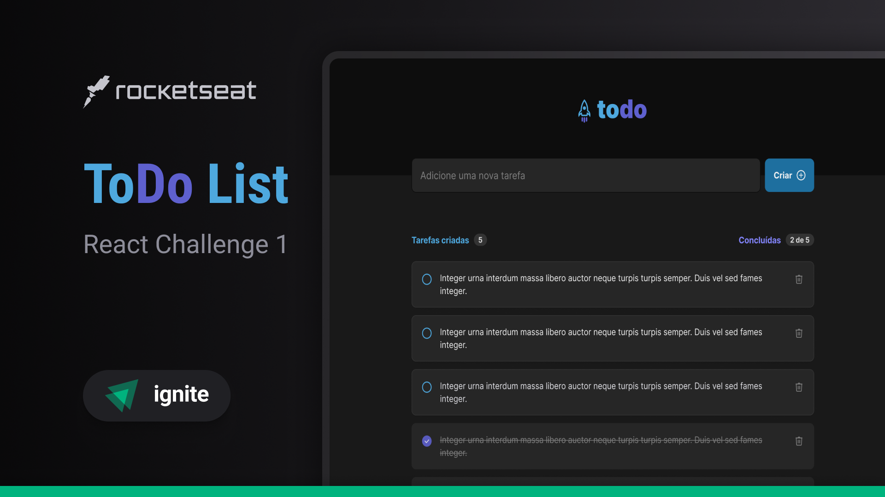
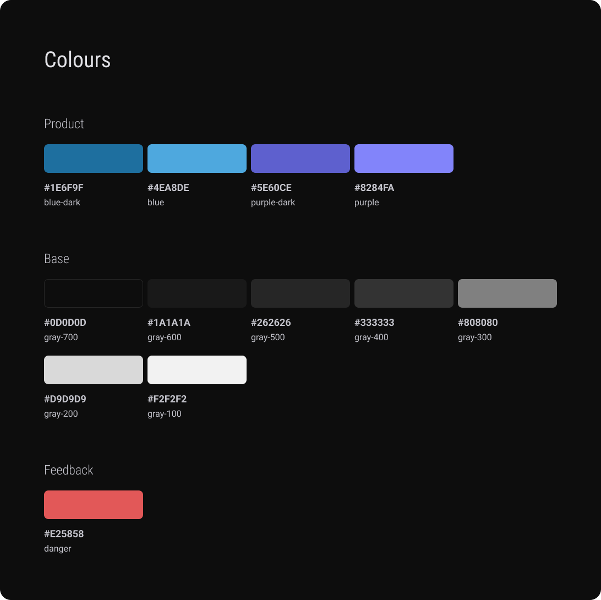
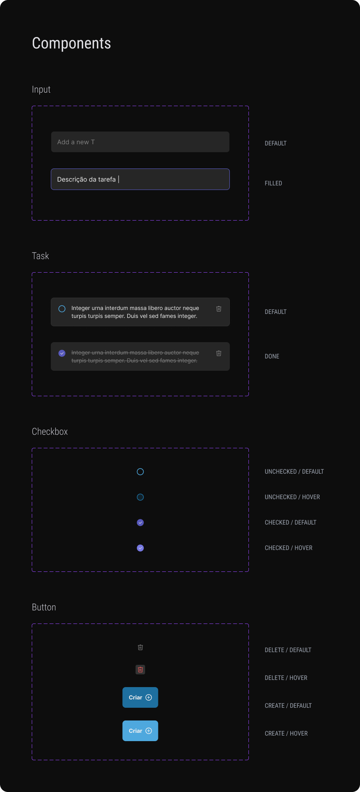

# React - Challenge 1 - React Concepts

## 💻 About Challenge

ToDo list to practice what was learned during <a href="https://www.rocketseat.com.br/ignite#trilhas">Rocketseat Ignite course - React Trail - Fundamentals of React</a>.

You can check the project live on 🔗 <a href="https://ignite-react-challenge1.netlify.app">ignite-react-challenge1.netlify.app</a>

## 📑 Project Functionalities

Main functionalites and challenge goals:

- Display a list of Tasks
- If list is empty, display this info
- Add a new Task
- Delete a Task
- Mark a Task as completed
- Replicate the design from figma
- Create project with Vite, using React + Typescript

## 🎨 Challenge Layout

The design was provided by Rocketseat, on the Figma <a href="https://www.figma.com/file/0n0zDN7zbzhRbaEO74Xesx/ToDo-List/duplicate">link</a>.

Every pixel should be according to the design, including animations and hover effects.

