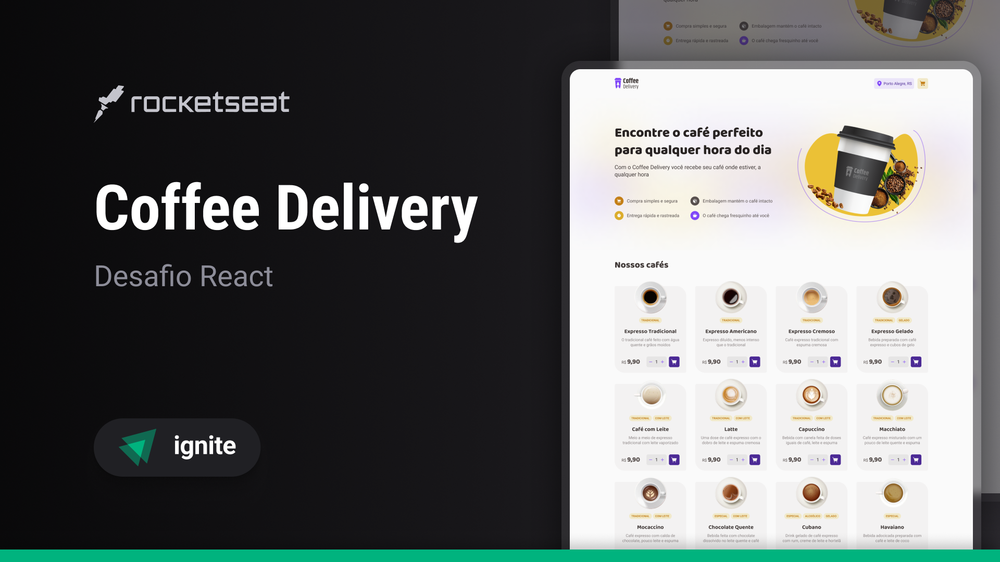
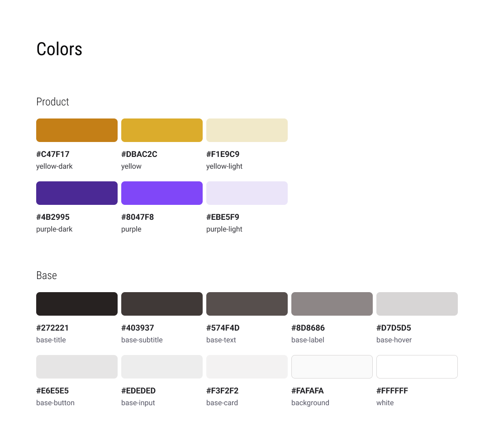
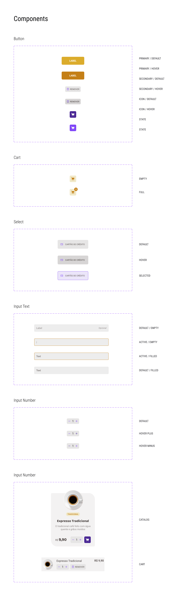

# React - Challenge 2 - SPA and Context

## 💻 About Challenge

Coffee e-commerce website to practice what was learned during <a href="https://www.rocketseat.com.br/ignite#trilhas">Rocketseat Ignite course - React Trail - SPA & Context</a>.

You can check the project live on 🔗 <a href="https://ignite-react-challenge2.netlify.app">ignite-react-challenge2.netlify.app</a>

## 📑 Project Functionalities

Main functionalites and challenge goals:

- Display a list of Coffees
- Add/remove Coffees from the Cart
- Use LocalStorage, Context and Reducer to accomplish Cart State/Functionalities
- Add Routes to project (react-router-dom)
- Create a Checkout form, that stores information globally
- Replicate the design from figma
- Create project with Vite, using React + Typescript

## 🎨 Challenge Layout

The design was provided by Rocketseat, on the Figma <a href="https://www.figma.com/file/5yT9ZzZmRQRS4yivGGB3pl/Coffee-Delivery/duplicate">link</a>.

Every pixel should be according to the design, including animations and hover effects.

