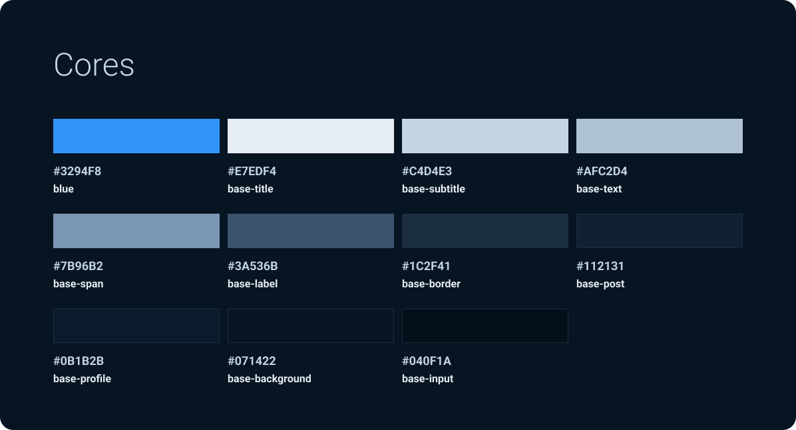
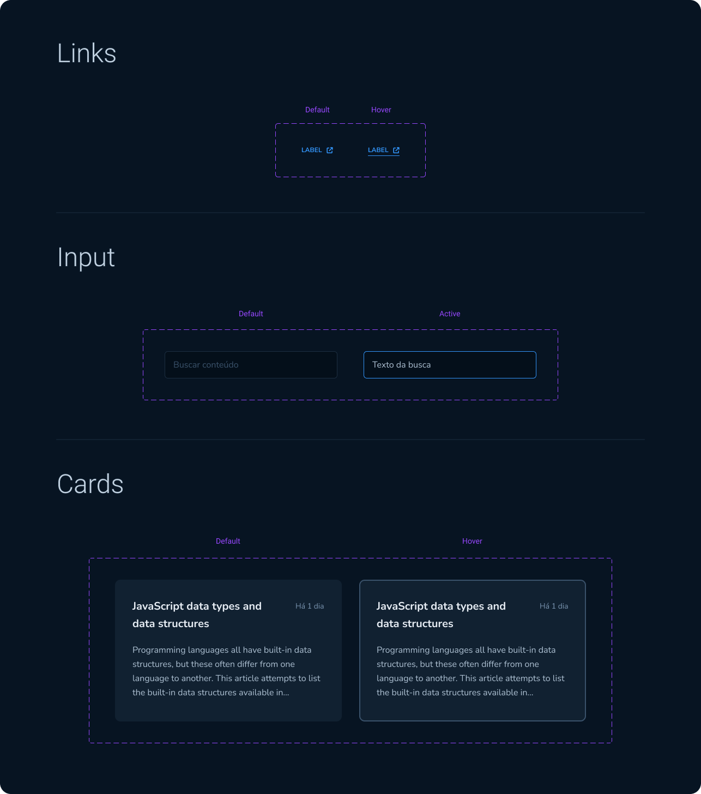

# React - Challenge 3 - API & Performance

## 💻 About Challenge

Github blog website to practice what was learned during <a href="https://www.rocketseat.com.br/ignite#trilhas">Rocketseat Ignite course - React Trail - API & Performance</a>.

You can check the project live on 🔗 <a href="https://ignite-react-challenge3.netlify.app">ignite-react-challenge3.netlify.app</a>

## 📑 Project Functionalities

Main functionalites and challenge goals:

- Fetch on Github API and display an User
- Fetch and display a list of Issues from a specific repository
- Input specific keyword and make a new fetch for issues with this keyword
- Display correctly filtered issues
- When clicking a specific Issue, display more information on a new page
- Replicate the design from figma
- Create project with Vite, using React + Typescript

## 🎨 Challenge Layout

The design was provided by Rocketseat, on the Figma <a href="https://www.figma.com/community/file/1138814951106121051">link</a>.

Every pixel should be according to the design, including animations and hover effects.

