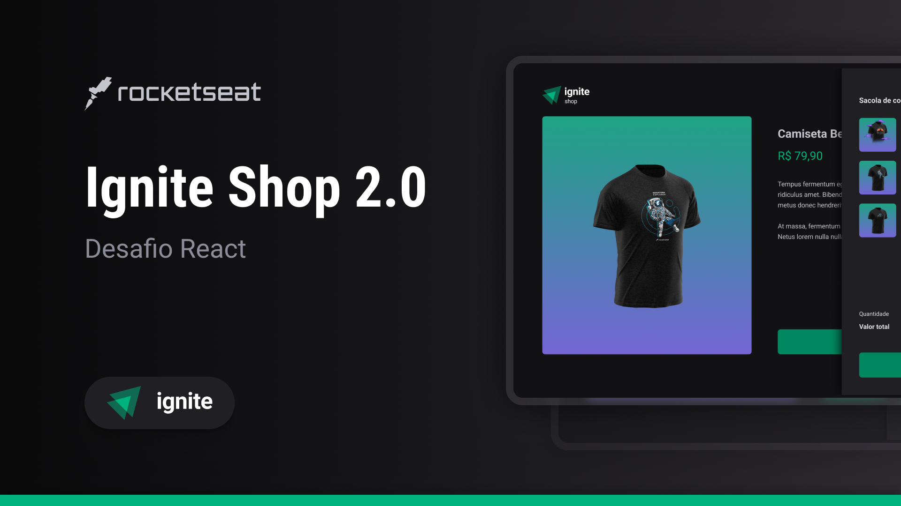
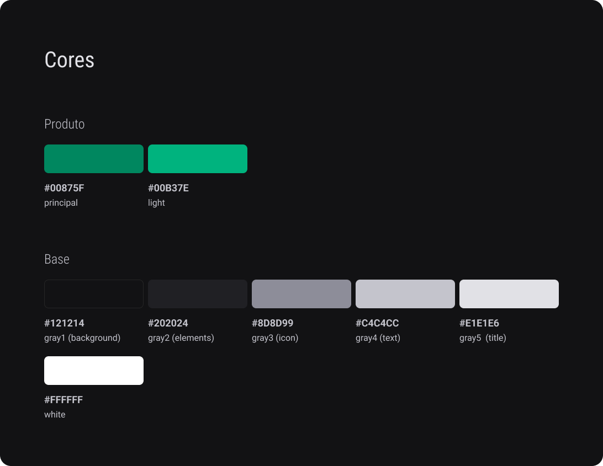
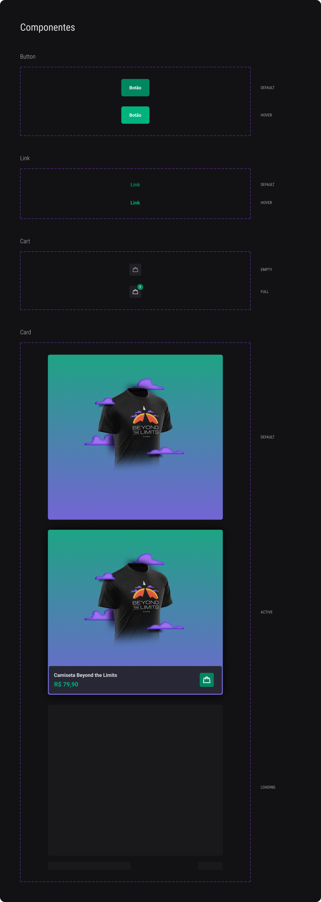

# React - Challenge 4 - Next.js Fundamentals

## 💻 About Challenge

E-commerce webpage to practice what was learned during <a href="https://www.rocketseat.com.br/ignite#trilhas">Rocketseat Ignite course - React Trail - Next.js Fundamentals</a>.

## 📑 Project Functionalities

Main functionalites and challenge goals:

- How to use Next.js
- Differences between Single Page and Server Side Rendering apps
- Use of getStaticProps/getStaticPaths with Next.js
- Use Stripe to replicate a e-commerce page
- Replicate the design from figma
- Create project with Next.js, using React + Typescript

## 🎨 Challenge Layout

The design was provided by Rocketseat, on the Figma <a href="https://www.figma.com/file/FxlDRKOmznBbTH8DsTgnZU/Ignite-Shop-2.0/duplicate">link</a>.

Every pixel should be according to the design, including animations and hover effects.

